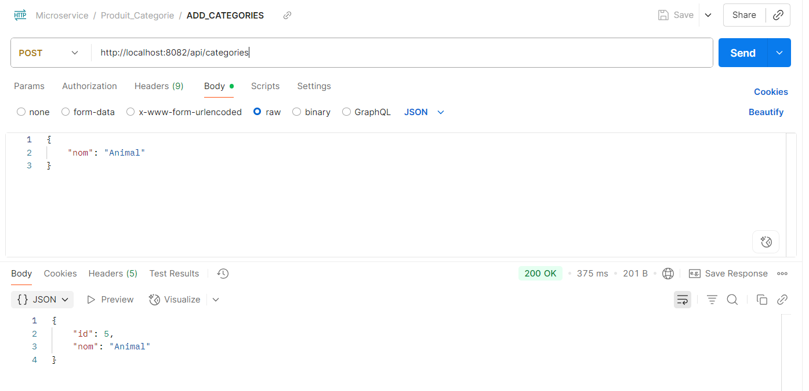
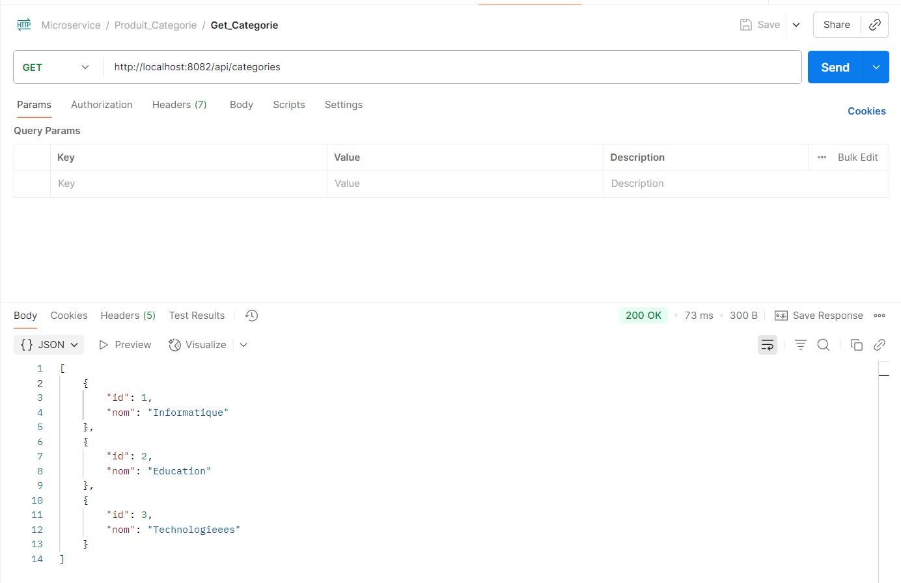

# **Description du projet**

Ce projet est une application e-commerce basée sur une architecture microservices développée en Java. 

# **Architecture**

L'application est composée de plusieurs microservices :
Gateway Service : Point d'entrée unique de l'application, gestion du routage des requêtes
Eureka Server : Service de découverte et d'enregistrement des microservices
Product Service : Gestion du catalogue produits (CRUD, recherche, catégories)
Order Service : Traitement et gestion des commandes
User Service : Gestion des utilisateurs et authentification

# **Environnement:**

JAVA    17
SPRING-BOOT 3.4.5
MAVEN 3.9.*

# [//]: #                                 **(TEST)**

